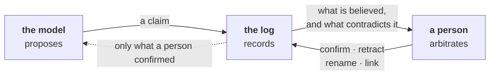
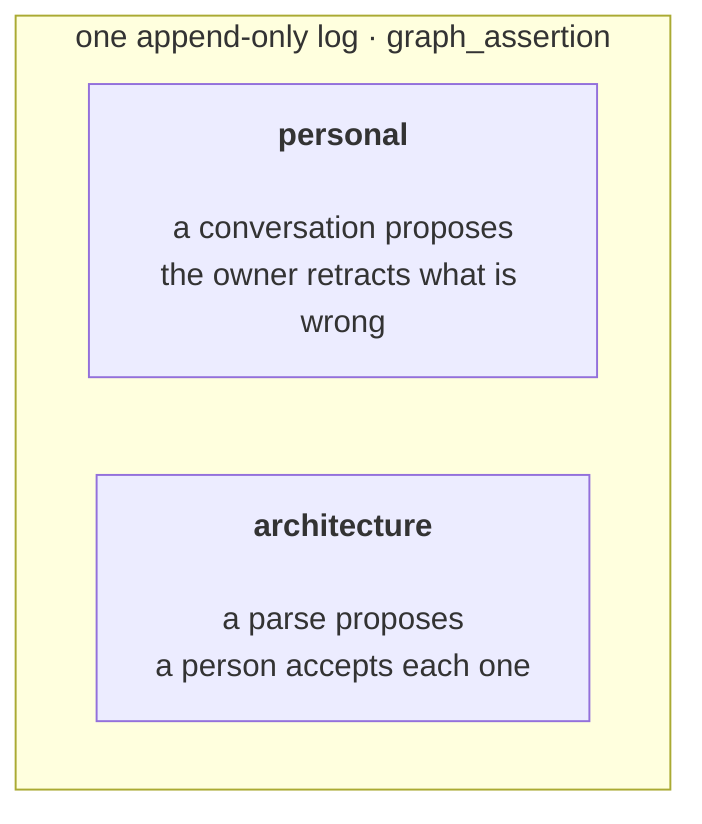

<h1 align="center">bacteria</h1>

<p align="center">
  <em>A neurosymbolic agent that builds a model of your system, and shows it to you.</em>
</p>

<p align="center">
  <a href="https://github.com/glb99/bacteria/actions/workflows/test.yml"></a>
  <a href="https://github.com/glb99/bacteria/actions/workflows/smoke.yml"></a>
  <a href=".python-version"></a>
  <a href="LICENSE"></a>
  <a href="docs/README.md"></a>
</p>

```
  you ──lives_in──> madrid          recorded 2026-08-12  ·  closed
   │
   └──lives_in──> barcelona         recorded 2026-09-04  ·  current
```

<p align="center">
  <sub>Both rows are still in the log. The first was <em>closed</em>, never deleted —<br>
  which is why <strong>“what did it believe last Tuesday?”</strong> has an honest answer.</sub>
</p>

---

## The idea

An agent that remembers things about you is common. An agent whose memory you
can **open, read, disagree with, and correct** is not.

bacteria is an experiment in the second. A language model does the reasoning —
probabilistic, fluent, occasionally wrong. Underneath it sits an **ontology**: an
explicit model of the entities in some domain and the relations between them,
stored as an append-only log of claims, each carrying who said it, when it was
believed, and what contradicts it.



That pairing — a probabilistic reasoner inside symbolic constraints — is what
makes it *neurosymbolic*, and the constraints are the half that is usually
missing.

Writing the model down is the point, because then both parties can look at the
same picture. A shared mental model rather than two private ones that quietly
diverge — which is where the real cost of working with an agent comes from: not
from its answers, but from carrying in your head what it does and does not know.

> [!IMPORTANT]
> Nothing the extractor believes reaches a prompt until a person confirms it.
> The graph is what the system believes about your world, not what it says.

### Two clocks

Most memory systems have one: they overwrite, and the past is gone. This one
separates *when a thing was true* from *when the system believed it*, so a
correction is a new belief rather than an erasure.

```
  valid time  ·  when it was true in the world
  ├──────────── madrid ─────────────┼──────── barcelona ─────────>
  2019                            2026                            open-ended

  recorded time  ·  when the system believed it
  ├─────────── "madrid" ────────────┼─────── "barcelona" ────────>
  2026-08-12                    2026-09-04                           now
              closed · superseded           still believed
```

A claim can also have *no* end date, which is different from having an
open-ended one — "I don't know when this stopped" and "this hasn't stopped" are
not the same statement, and the overlap logic returns `True`, `False` **or
`None`** accordingly. [How the graph works](docs/architecture/memory-graph.md).

## The console

Two surfaces over one model. A **chat** that runs real agent turns, and a
**graph** that draws what came out of them — believed, proposed, and contested.

```
┌────────────────────────────────────────────────────────────────────┐
│  bacteria ://console   v0      chat  [graph]  architecture         │
├────────────────────────────────────────────────────────────────────┤
│                                                                    │
│  layout  [by thing] by relation        confirmed ─   proposed ┈    │
│                                                                    │
│             acme                                                   │
│              │                   madrid ── since 2019              │
│              │                  ╱                      ·           │
│     you ─────┼───── lives_in ──┤                  contested        │
│              │                  ╲                      ·           │
│              │                   barcelona ── since 2021           │
│             rust                                                   │
│                                                                    │
│  none of this is sent to the model                                 │
└────────────────────────────────────────────────────────────────────┘
```

Everything there is a *claim*, never a fact — retractable, renameable,
linkable, rejectable, and none of it edits history.

## Where it stands

**A working service, an early model.** Conversations survive restarts, the agent
runs real turns, the extractor proposes claims, and the console draws them.

There are two ontologies, and they share one table with opposite trust models —
which is the structural fact most people are surprised by:



**Software architecture is the first domain** — parsing a codebase into modules,
imports, tables and boundary violations, deterministically and with no model
involved, then asking a person to accept or reject each proposal. It is first
because its truth is checkable: you can read the source and know whether a claim
is right.

Two more are intended once the substrate holds: **organisations** — departments,
ownership, risks, actions taken through Slack — and **research** — concepts,
what is poorly understood, actions taken through deep search.

> [!NOTE]
> What is missing is recorded at the place it would be filled rather than only
> in a list. The list is [`docs/status.md`](docs/status.md).

## Quickstart

Needs Python 3.13+, [uv](https://docs.astral.sh/uv/), [just](https://just.systems/)
and Docker. An `ANTHROPIC_API_KEY` or `GEMINI_API_KEY` in `.env` is required for
anything that calls a model.

```bash
cp .env.example .env
just db-up && just install && just migrate
```

Issue yourself a credential. It is an operator command rather than an endpoint,
and the key is printed once, because only a hash is stored:

```bash
uv run bacteria-admin issue-key acme-corp --label "local dev"
```

Then run it. The worker is a second process, and deferred work only happens if
it is running:

```bash
just serve      # the API on :8000 — migrates first
just worker     # in another terminal
```

The console is served at `/`, and interactive API docs at `/docs`.
`just --list` is the full set of commands.

> [!WARNING]
> `just db-up` is not optional. The tests skip without Postgres, `just cov`
> fails rather than skipping, and there is no SQLite fallback anywhere — it was
> the default for a while and hid three separate bugs.

<details>
<summary><strong>Talking to it without a browser</strong></summary>

<br>

```bash
curl -sX POST localhost:8000/chat/sessions \
     -H "Authorization: Bearer $BACTERIA_KEY"

curl -sX POST localhost:8000/chat/sessions/$SESSION/turns \
     -H "Authorization: Bearer $BACTERIA_KEY" \
     -H "Content-Type: application/json" \
     -d '{"text": "hello"}'
```

Or hold the same conversation with no server at all, against the same database
and the same code path:

```bash
uv run bacteria-admin chat acme-corp
```

</details>

## How it is built

A uv workspace of two packages, and the split is enforced by packaging rather
than by discipline.

| Package | Imported as | What it is |
|---|---|---|
| [`backend/agent`](backend/agent) | `bacteria.agent` | The agent. Layered by ownership boundary, self-contained, independently runnable and testable. No database, no web framework, no configuration of its own. |
| [`backend/app`](backend/app) | `bacteria.app` | The service that hosts it — HTTP API, persistence, credentials, and the ontology features. |

The application depends on the agent; the agent does not know the application
exists. What connects them is a protocol the agent declares and the application
implements, which is what lets the agent be lifted into a different host.

<details>
<summary><strong>Why there is no <code>__init__.py</code> at the namespace root</strong></summary>

<br>

Both live under the `bacteria`
[PEP 420 namespace package](https://peps.python.org/pep-0420/), so neither
distribution has an `__init__.py` there — one in either would claim the
directory outright and hide the other. They are released separately:
`bacteria-agent` carries real semver because things implement its protocols,
`bacteria-app` stays at `0` because nothing consumes it.

</details>

## Documentation

**[`docs/README.md`](docs/README.md) routes every question.** The short version:

| | |
|---|---|
| [Architecture](docs/architecture/README.md) | The shape of the whole, drawn as sequence diagrams |
| [The memory graph](docs/architecture/memory-graph.md) | The ontology's conceptual model |
| [API reference](docs/api.md) | Every route, annotated |
| [Decisions](docs/adr/README.md) | Why each thing is the way it is |
| [Status](docs/status.md) | What works, and what is deliberately absent |
| [Research](docs/research/README.md) | Where the design came from — sources, analyses, dialogues |
| [Glossary](docs/research/glossary.md) | *Valid time*, *recorded time*, *canonical core* — terms that mean something specific here |

> [!TIP]
> Working on this with an AI agent? [`CLAUDE.md`](CLAUDE.md) is the door for
> that, and is deliberately a different document from this one.

## Prior art

bacteria is an implementation of other people's ideas, and it is worth saying
whose.

| | |
|---|---|
| **Neurosymbolic agents** | Frank Coyle, [*Why Agentic Systems Need Ontologies*](https://www.youtube.com/watch?v=Sir59K8ZDPU) — a reasoning engine operating over an ontology, placed inside the agentic loop |
| **The ontology** | Palantir's [Foundry Ontology](https://www.palantir.com/docs/foundry/ontology/overview) — objects, links and actions as a model of a business rather than of its databases |
| **The agent's layering** | Vinoth Govindarajan's [The Agent Stack](https://theagentstack.substack.com/p/the-agent-stack-part-5-context-retrieval) series, which `backend/agent` follows |
| **Domain-driven design** | For the claim that the shared language *is* the deliverable, which is this project's thesis restated |

Every source is ingested verbatim, analysed, and argued with in
[`docs/research/`](docs/research/README.md). Nothing in the design arrived
without a citation.

## Deployment

[FastAPI Cloud](https://fastapicloud.com), on every push to `main`. That platform
runs one process and this service is two, so the worker runs inside the API
there — [ADR 0001](docs/adr/0001-run-the-worker-in-the-api-process.md) says what
that costs. Two processes is the better shape and already works:
[`Dockerfile`](Dockerfile) plus [`compose.app.yml`](compose.app.yml), or
`just stack`. Setup is in
[`docs/guides/deployment.md`](docs/guides/deployment.md).

## Contributing

[CONTRIBUTING.md](CONTRIBUTING.md) has the conventions and
[`docs/guides/development.md`](docs/guides/development.md) has the commands.
`just hooks` installs the pre-commit hook.

This is an experimental project and its design is still being argued with. The
arguments live in [`docs/research/dialogues/`](docs/research/dialogues/), and
disagreement is welcome there.

## License

Apache 2.0 — see [LICENSE](LICENSE).
