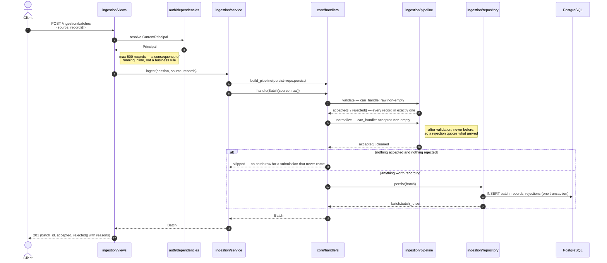
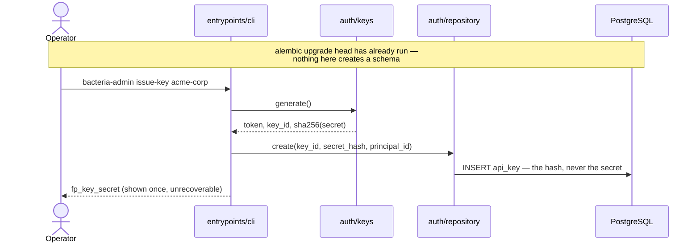

# Architecture

Two packages. `bacteria.agent` is the agent — layered by ownership boundary, knowing
nothing about databases, HTTP, or this application. `bacteria.app` is the
application that hosts it. The dependency runs one way, and what connects them
is a protocol the agent declares and the application implements.

What each module owns is in its own docstring; this file is the shape of the
whole, in the order a request moves through it.

---

## A chat turn

The deepest path in the system: it touches authentication, authorization, the
agent's whole layer stack, and persistence.

```mermaid
sequenceDiagram
    autonumber
    actor Client
    participant Route as chat/views
    participant Auth as auth/dependencies
    participant Access as chat/access
    participant Service as chat/service
    participant Runtime as agent/runtime
    participant Context as agent/context
    participant Model as agent/model
    participant Repo as chat/repository
    participant DB as PostgreSQL
    participant Provider as Anthropic / Gemini

    Client->>Route: POST /chat/sessions/{id}/turns<br/>Bearer fp_key_secret

    rect rgb(240, 240, 245)
        note over Auth,DB: Authentication — who is calling
        Route->>Auth: resolve CurrentPrincipal
        Auth->>Auth: keys.split(token)
        Auth->>DB: SELECT api_key WHERE key_id = ...
        DB-->>Auth: secret_hash, principal_id, revoked_at
        Auth->>Auth: compare_digest(sha256(secret), hash)
        alt malformed, unknown, wrong secret, or revoked
            Auth--xClient: 401 — identical for every failure
        end
        Auth-->>Route: Principal(id, label)
    end

    rect rgb(240, 245, 240)
        note over Access,DB: Authorization — may they have this
        Route->>Access: load_owned_session(principal, session_id)
        Access->>Repo: get_state(session_id)
        Repo->>DB: SELECT session, transcript, memory
        DB-->>Repo: rows
        Repo-->>Access: SessionState (detached copy)
        alt absent or owned by someone else
            Access--xClient: 404 — the two are indistinguishable
        end
        Access-->>Route: SessionState
    end

    Route->>Service: run_turn(repository, provider, session_id, text)
    Service->>Model: build_model_client(provider)
    Service->>Runtime: Runtime(model_client, session_store=repository)
    Service->>Runtime: run_turn(session_id, user_text)

    rect rgb(245, 242, 236)
        note over Runtime,Provider: The agent's turn — orchestration only
        Runtime->>Repo: get_state(session_id)
        Repo->>DB: SELECT transcript, memory
        DB-->>Repo: rows
        Repo-->>Runtime: SessionState
        Runtime->>Context: assemble_context(state, user_text)
        Context-->>Runtime: bounded window + system prompt
        note right of Runtime: evidence = [user message]<br/>accumulated as we go, not at the end
        Runtime->>Model: send(messages, system, tools=None)
        Model->>Provider: HTTPS (async)
        Provider-->>Model: content blocks
        Model-->>Runtime: ModelResponse — tool calls would be proposals
        note right of Runtime: no tool registry is passed today;<br/>approval has nobody to ask over HTTP
        Runtime->>Repo: commit(session_id, evidence)
        Repo->>DB: INSERT transcript items
        Repo-->>Runtime: committed SessionState
    end

    Runtime-->>Route: RunResult(run_id, response, committed_state)
    Route-->>Client: 200 {run_id, reply}

    note over Runtime,DB: On any exception the runtime appends a run_error<br/>and commits before re-raising, so a failed turn<br/>still explains itself. The client gets 5xx.
```

**Three things this picture is for.**

*Authentication and authorization are separate boxes, and that is the point.*
The first establishes identity, the second decides access, and they live in
different packages — `auth/` has no idea what a session is, and `chat/access.py`
never inspects a credential. This is the agent's own session ≠ authorization
boundary, applied to the layer above it.

*The runtime orchestrates and implements nothing.* Every arrow out of it goes to
another layer. It never formats a prompt, never talks to a provider, and never
writes state — the moment it does any of those, ownership questions stop having
answers.

*The model proposes and the store disposes.* Everything the model produces
reaches the database only by being passed to `commit`, which is the sole write
path for turn state.

**A cost visible in the diagram:** `get_state` is called twice per turn — once by
the ownership check, once by the runtime. It loads the entire transcript both
times. Harmless on short conversations and the first thing to fix when they get
long; the fix is to pass the already-loaded state into the runtime rather than
having it re-read.

---

## An ingestion batch

No agent, no model. This is the path the handler chain exists for.



Steps do not know the order; `build_pipeline` is the only place it exists. A
step declines through `can_handle` rather than the caller branching around it,
which is why "everything failed validation" still persists — that batch is the
one whose evidence matters most.

---

## Issuing a credential

Not an HTTP route, deliberately.



Minting credentials over HTTP requires a credential to authorize it, and the
first one has nowhere to come from. It is also the single most valuable thing on
a service to compromise. Running this needs access to the machine and the
database, which is the right bar.

---

## Where the boundaries are

| Boundary | Enforced by | What breaks if it erodes |
|---|---|---|
| The agent knows nothing of this app | `bacteria.agent` imports no ORM, no web framework | The agent stops being vendorable elsewhere |
| Authentication ≠ authorization | separate packages, `auth/` vs `chat/access.py` | "You know the id" becomes "you may read it" |
| The runtime implements nothing | every step delegates | Ownership questions stop having answers |
| Only the store writes turn state | one `commit` path, detached reads | State edited from outside, with no trace |
| Capability ≠ execution | `tools/registry` vs `tools/execution` | The model gains the ability to act, not just ask |
| Entrypoints hold no logic | omitted from coverage by rule | Untested code in the least tested place |
| Migrations own the schema | nothing calls `create_all` at startup | A process boots against a database missing a column |
