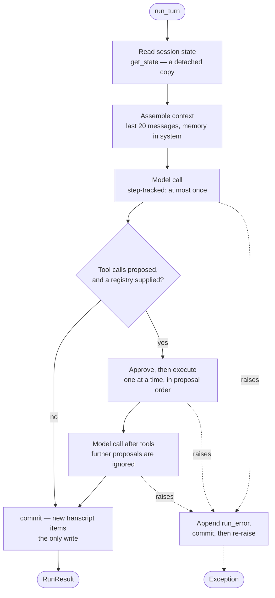

# Architecture

How the system fits together, what each layer owns, and what it refuses to do.
For *why* any particular decision was made, see [`adr/`](adr/). For the precise
behavior of a function, read its docstring — that is the reference, and it is
kept next to the code on purpose.

---

## The shape of the thing

An agent turn is a small loop with a lot of ways to get subtly wrong. The loop:

1. Work arrives from outside.
2. A bounded slice of state is assembled into a request.
3. A model is called. It answers, or it asks for a tool.
4. If it asked, the request is checked, run, and its result fed back.
5. Everything that happened is committed to the authoritative record.

Written as one function that would be about forty lines. It is six packages
instead, and the reason is that each step has an ownership question attached
that only stays answered if something structurally enforces it:

| Step | The question | Enforced by |
|---|---|---|
| 2 | What is the model allowed to see? | `context` owns assembly; the runtime never reads the transcript |
| 3 | Can the model make something happen? | `model` imports no tool module and no filesystem |
| 4 | Did anyone agree to this? | `execution` is the only caller of a handler, and it checks first |
| 5 | Who can change the record? | `session` returns deep copies; nothing else can write |

Delete any of those boundaries and the code still works. It stops being
*checkable*, which is a different and worse failure — the properties become
things everyone has to remember rather than things the code guarantees.

---

## Request path

One turn, in order, with the module responsible for each step.

```
bacteria.interfaces.cli.main
  │  reads a line of input
  ▼
Runtime.run_turn                                    runtime/runtime.py
  │
  ├─ SessionStore.get_state ─────────────────────── session/store.py
  │    returns a deep copy; the runtime cannot corrupt the record
  │
  ├─ assemble_context ──────────────────────────── context/assembly.py
  │    last N messages + memory as a system prompt
  │
  ├─ ToolRegistry.schemas_for_run ──────────────── tools/registry.py
  │    name/description/schema only — no handler leaves the registry
  │
  ├─ SendsMessages.send ────────── model/client.py | model/gemini_client.py
  │    retries transient failures; classifies everything else
  │
  ├─ if the model proposed tools:
  │    ├─ execute_tool_call ────────────────────── tools/execution.py
  │    │    resolve → approve → run, in that order
  │    │    └─ cli_approve ───────────────────── tools/approval.py
  │    └─ SendsMessages.send (again, with results)
  │
  └─ SessionStore.commit ───────────────────────── session/store.py
       the only write. Reached on both the success and failure paths.
```

The same turn as control flow, which is where the branching and the failure path
are visible:



**There is no loop.** Every other box has one way out, and `call2` returns
whatever it returns — if the model proposes more tools there, nothing acts on
them. That is [ADR 0011](adr/0011-single-round-tool-loop.md), and it is the
shape's biggest departure from the usual agent runtime, which loops until the
model stops asking.

**`evidence` is not a store.** It is a local list that accumulates
`TranscriptItem`s as the turn progresses — the user message first, then one per
tool call, then the assistant reply — and it becomes the transcript when the
store applies it. Accumulating rather than assembling at the end is what makes
the dashed path above possible.

Two more things to notice about the shape.

**The runtime touches everything and implements nothing.** Every arrow leaves
the runtime and comes back. When that stops being true — when prompt formatting
or a transcript append happens inline because it was briefly easier — the
ownership map above becomes fiction, and answering "what goes into context?"
turns into an audit of the orchestration path instead of reading one function.

**Commit is on the failure path too.** The `except` branch in `run_turn` appends
a `run_error` item and commits before re-raising. A run that fails after doing
real work must not vanish, and the natural implementation — build the transcript
at the end, from the results — loses exactly the runs worth investigating.

---

## Layers

### `interfaces` — where work enters

Receives an event and hands it to the runtime. Also owns **composition**: this
is the only place that names a concrete model provider, a concrete tool set, or
a concrete approval mechanism. Every other module receives what it needs as an
argument, which is why no other module reads configuration.

A second interface (HTTP, a bot, a scheduled job) is another module this thin,
not a change anywhere below it.

### `runtime` — sequencing and step discipline

Decides what happens in what order, and what survives when a step fails.
Delegates every step. Owns two properties directly:

- `StepTracker` refuses to run the same step id twice within a run.
- Any exception commits accumulated evidence before propagating.

Holds no state between turns. A second turn sees the first only because it
re-reads the store.

### `context` — the working set

Turns session state into the bounded slice the model sees for one request.
Currently a hard recent-message window; memory is surfaced through the system
prompt rather than appended to the messages, so a preserved fact never
masquerades as something the user just said. Both are bounded, and both treat a
limit of 0 as 0 — `list[-0:]` is the whole list, so the strictest bound used to
be the loosest.

Assembling context is a policy decision — what is relevant, what fits, what is
worth its cost — which is why it is a layer and not a formatting step.

### `model` — talking to a provider

`protocol.py` defines the contract: `async send(messages, **kwargs) ->
ModelResponse`, plus the `ToolCall` shape. Both clients implement it; every
caller uses it. Implementations use their SDK's async surface —
`AsyncAnthropic`, `genai`'s `.aio` — rather than threading a blocking call,
which would relocate the cost of waiting rather than remove it.

Retry stays a hand-written loop in each client, waiting with `anyio.sleep` so a
backoff costs no thread. A retry library was tried and backed out: it brought
jitter and exponential backoff worth having eventually, but the loop it replaced
is fifteen readable lines, and trading them for a dependency is not a trade this
project wants to make before a second caller exists to need it.

The three concerns behind a model call are kept nameable even though one hosted
API covers all of them — **asset** (which model), **serving** (delivery, retry),
**contract** (request and response shapes). That split is visible in
`errors.py`, where the taxonomy follows those lines so retry policy can be read
off the exception class. Exactly one category retries: `ServingError`.

This layer cannot execute anything. It imports no tool module.

### `session` — the authoritative record

The single source of truth. Three kinds of state, kept apart because their
lifecycles differ:

| | Lifetime | Written by |
|---|---|---|
| `transcript` | Append-only, permanent | `commit` |
| `working_state` | Current turn; assume nothing survives | `commit` |
| `memory` | Deliberate, until deliberately removed | `remember` / `forget` |

Everything arrives as a proposal and becomes real only when this layer applies
it. `get_state` returns a deep copy, which is what turns "only this layer
writes" from a convention into a property of the code.

### `tools` — capability, permission, action

Three modules for three questions that are usually written as one:

- `registry` — what exists, and what this run is told about.
- `approval` — should *this* call, with *these* arguments, happen now.
- `execution` — run it, once the first two are answered.

The seam being protected is that the model **asks** and the system **acts**, and
those are not the same event. Fold approval into a handler and it becomes
invisible; fold execution into the registry and describing a capability starts
implying authority to use it.

---

## Invariants

Properties with tests. Breaking one is a bug, not a design change. Find them in
the source with `grep -rn "Invariant:" src/`.

| Invariant | Why it matters | Test |
|---|---|---|
| Only `commit`/`remember`/`forget` mutate state | Authoritative state edited from outside leaves no trace of who did it | `test_get_state_returns_a_copy_not_the_authoritative_record` |
| A handler never reaches the model | The model would hold the ability to run code, not just request it | `test_schema_never_exposes_the_handler` |
| Rejection means nothing ran | A gate checked after the fact is not a gate | `test_rejected_approval_prevents_the_handler_from_running` |
| Only `ServingError` retries | Retrying a non-transient failure burns quota to fail identically | `test_asset_failure_is_not_retried` and siblings |
| A retry re-sends an identical request | What makes retrying provably side-effect free | `test_serving_failure_is_retried_with_identical_request_then_succeeds` |
| A step runs at most once per run | Guards a side effect being repeated by control flow looping back | `test_step_cannot_silently_run_twice` |
| A failed run still commits evidence | Otherwise the runs worth investigating are the ones with no record | `test_a_failed_model_call_still_leaves_the_user_message_as_evidence` |
| Tool calls are executed only via `execution` | Concentrates every side effect in one auditable place | `test_runtime_executes_tool_calls_via_the_execution_module_not_the_model_client` |
| Opaque provider state survives a round trip | Some providers reject a follow-up call without it | `test_thought_signature_is_captured_and_echoed_back_on_the_next_turn` |
| A synchronous handler never runs on the event loop thread | One blocking tool would stall every concurrent turn in the process | `test_a_synchronous_handler_does_not_run_on_the_event_loop_thread` |
| A coroutine handler or gate is awaited, not returned | An un-awaited coroutine is truthy and stringifies — the tool appears to succeed and returns nonsense, the gate approves everything | `test_a_coroutine_handler_is_awaited_not_returned_unrun`, `test_a_coroutine_approval_gate_is_awaited` |

---

## Deliberate gaps

The authoritative list lives in the code, next to where each would be filled:
`grep -rn "Not built:" src/`. Summarized here with what it would take.

### Persistence — `session/store.py`

Sessions live in a process-local dict. Nothing survives exit, so on its own this
package has no resume and no memory beyond the process.

Note what a durable store does *not* buy: memory is keyed by session, so a host
that persists it still starts every new session with none. Memory that follows a
user across sessions would re-key `remember` and change `SessionRepository` —
a boundary change, deliberately not made ([ADR 0016](adr/0016-memory-is-written-by-the-owner-not-the-model.md)).

The seam is already right: `SessionStore`'s four public methods are the complete
operation set a backing store needs. Persistence is a second implementation of
this class plus a way to select one — not a change to any caller. What it drags
in: serialization for `TranscriptItem` and `MemoryEntry`, and a concurrency
story, because a shared store means `commit` is no longer the only writer.
Whatever that story is belongs inside `commit`, which is part of
why it stays the single write path while it is still a thin one.

### Durable execution — `runtime/runtime.py`

Run state lives in local variables. A crash mid-turn loses the turn.
`StepTracker` gives idempotency *within* a run — a much weaker property than
idempotency across restarts, and easy to mistake for it.

Requires persisting `run_id` and the executed-step set after each step, and
reloading on resume. Blocked on persistence: a resumed run needs the state it
was operating on.

### Isolation — `tools/execution.py`

A handler runs in-process with full privileges. Approval answers "should this
happen" and says nothing about "how far does the damage reach" — different
controls, and only one exists. Until a sandbox wraps the handler call, every
registered tool must be trusted first-party code. That is the security model,
stated plainly so it is not mistaken for an oversight.

Related and also absent: timeouts, resource limits, and any marking of
untrusted content flowing back from a tool into the model's context.

### Retrieval — `context/assembly.py`

No external evidence sources exist, so there is nothing to retrieve. When one
does, it attaches as an added section — and must arrive as *candidate evidence*
rather than authority. Also missing here: summarization (needed once
conversations outgrow the window) and token-aware budgeting (the window counts
messages, so twenty long ones cost far more than twenty short ones).

### Identity and policy — `tools/approval.py`

Approval exists; authorization does not. There is one local user, no principals
to distinguish, and no policy to evaluate. The three controls that get collapsed
into each other are named in that module's docstring specifically so the missing
two stay visible.

`cli_approve` also blocks on stdin, so no non-interactive surface can use it.
That needs a different implementation of the same `(ToolCall) -> bool` shape —
pause, notify, resume — which needs durable run state first.

### Multi-round tool loops — `runtime/runtime.py`

Exactly one round per turn: model, tools, model, done. Lifting it means looping
until the model stops asking, which needs a round cap, a cost budget, and a
policy for partial failure mid-loop.

### Evaluation and feedback

No behavioral eval suite, no release gate, no online monitoring. The test suite
covers architecture, not agent quality. Also unsplit: trace and audit are one
record here, which is right for one developer and wrong the moment those two
audiences differ — debugging wants broad access, audit wants tight control.

---

## Extending it

**A new tool.** Copy `tools/notes.py`. Write a factory returning a
`ToolDefinition` — a factory rather than a module-level constant, so tests can
point it at a temp path. Register it in `interfaces/cli.py:build_tool_registry`.
Write tests for the handler's side effect; the registry's own tests already
cover registration.

**A new model provider.** Implement `send()` per `model/protocol.py` and add one
entry to `PROVIDERS` in `interfaces/cli.py`. Budget for real work: the messages
crossing the protocol use Anthropic's block shapes ([ADR
0006](adr/0006-anthropic-block-shapes-as-internal-format.md)), so a non-Anthropic
client translates in both directions. Read `gemini_client.py` first — it shows
the size of that job, including the parts that only fail against a live API.
Classify failures into the existing taxonomy; check where the SDK reports
missing credentials, because that varies and is easy to miss.

**A new interface.** Another module beside `cli.py`. It composes and it receives;
it must not accumulate agent logic, or adding a third channel means
reimplementing the agent rather than adding a file.

**Persistence.** Start at `session/store.py`, above. It is the gap most other
gaps are waiting on.
